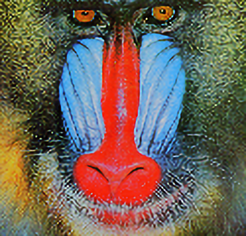

# Axell AI Contest 2024(最終17位)
https://signate.jp/competitions/1374

このコンペは4倍超解像モデルの精度(PSNRで評価)を競うものだったが、推論時間の制限(Tesla T4で1枚あたり0.035sec以内)があり、モデルの高速化も重要だった。

||||
|:---:|:---:|:---:|
|低解像画像|Bicubic補間|AI超解像|

# ディレクトリ構造
    .
    ├── dataset/
    │   ├── train/          <- 訓練データ(配布ファイルとkaggleからとってきたファイル)
    │   └── validation/
    │       ├── 0.25x/      <- 検証データ(低解像度)
    │       └── original/   <- 検証データ(高解像度)
    ├──output/              <- 検証データを高解像度にしたファイル
    ├── sample_generate
    │   ├── baboon.png      <- サンプルの画像
    │   └── output_images/  <- サンプルの画像をAIとbicubicで高解像度化したもの
    ├── submit/
    │   └── model.onnx      <- 学習済みモデル
    ├── train.py            <- 学習させるファイル
    ├── train.py            <- 学習中のlossとPSNR(png)
    ├── train.py            <- 学習中のlossとPSNR(csv)
    ├── generate.py         <- サンプル画像を低解像度にして高解像度画像を生成するファイル
    ├── README.md           <- このファイル
    └── validation.py       <- 学習済みモデルの検証

検証データには配布された画像を使用した
訓練データに関しては配布されたデータに加えて、[kaggleのdateset](https://www.kaggle.com/datasets/kabshaansariya/super-resolution-imagenet-pairs)から画像を追加した。

